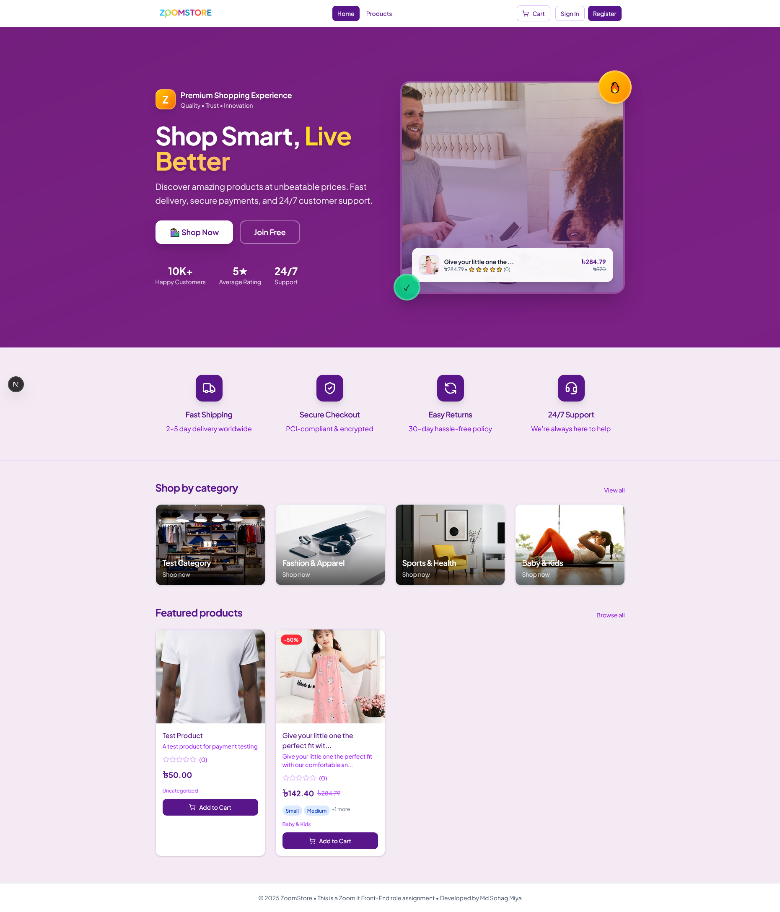
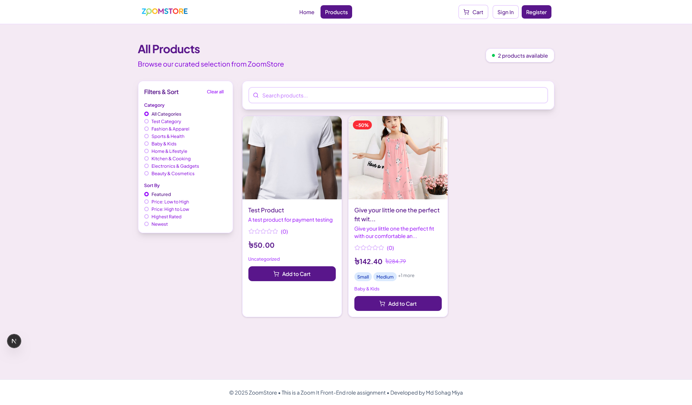
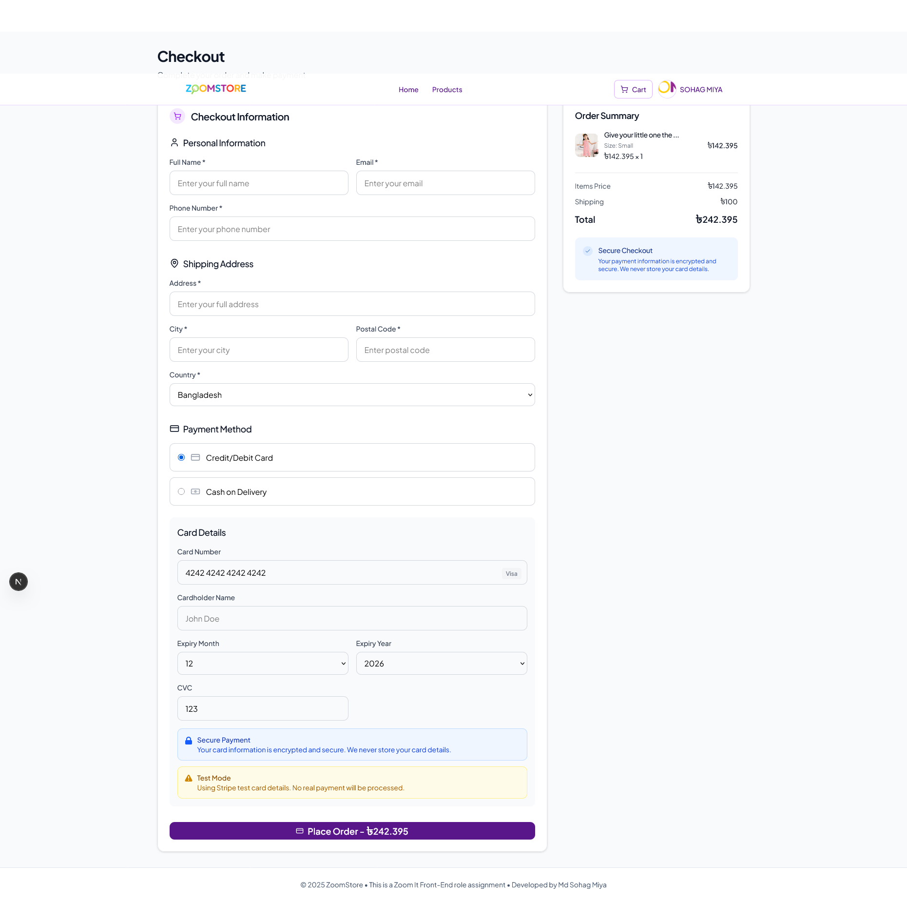
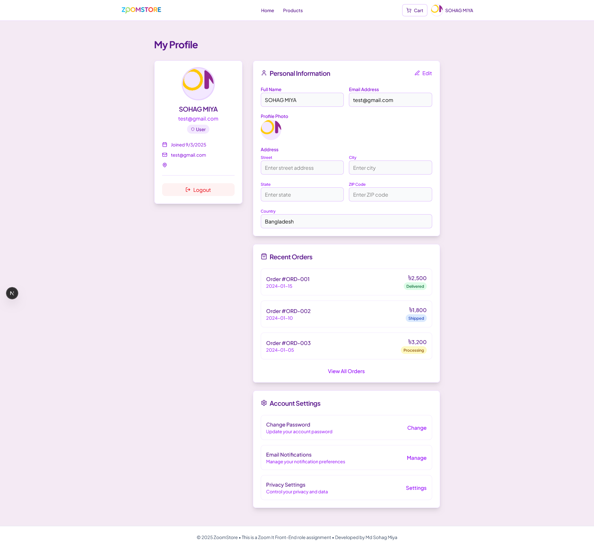
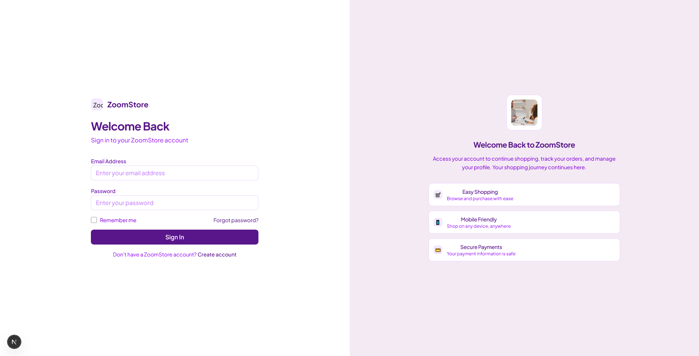
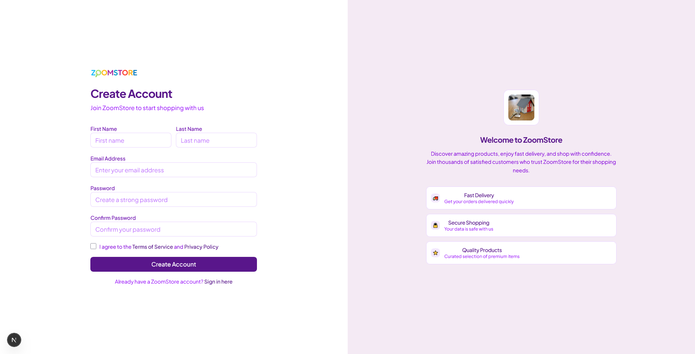
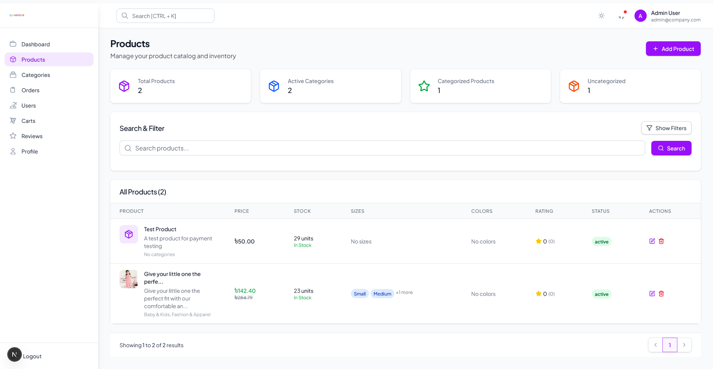
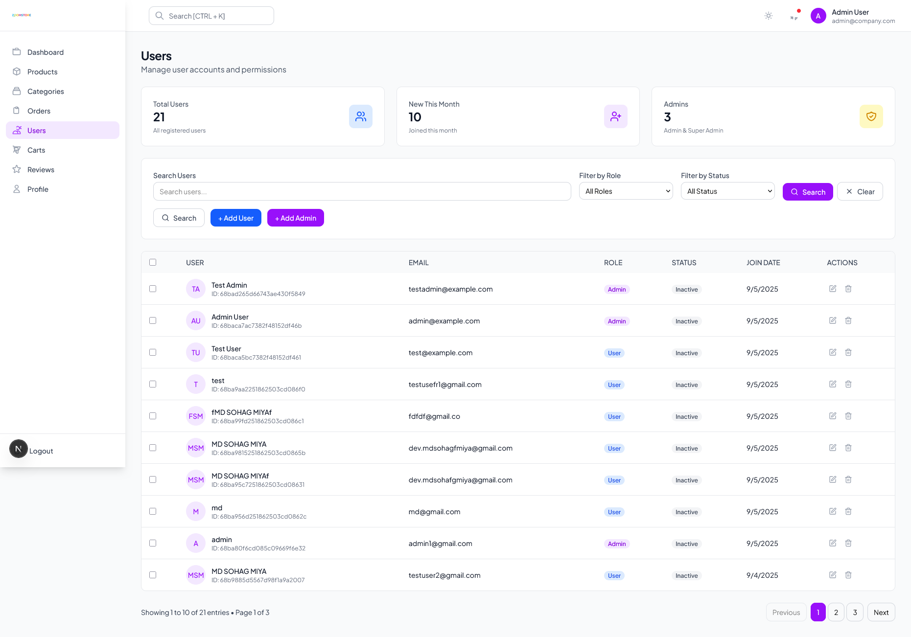
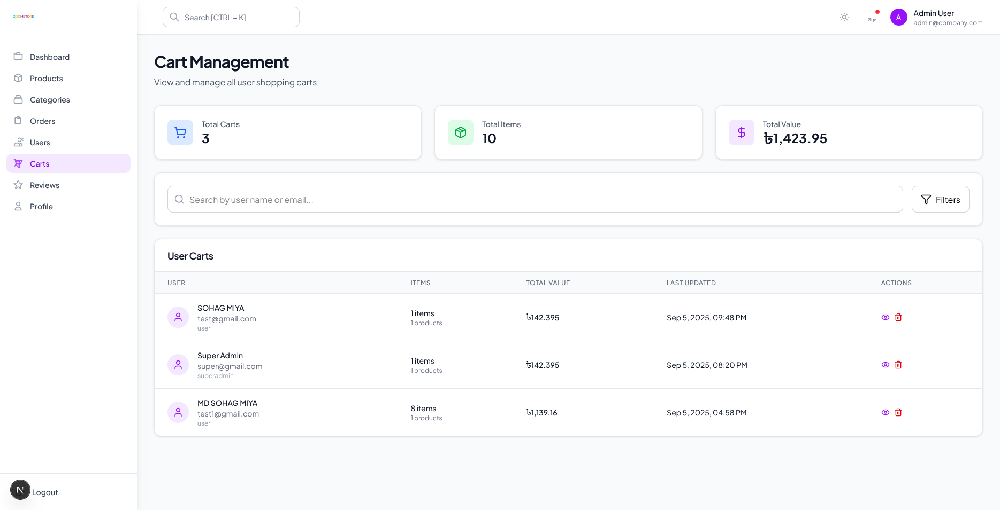
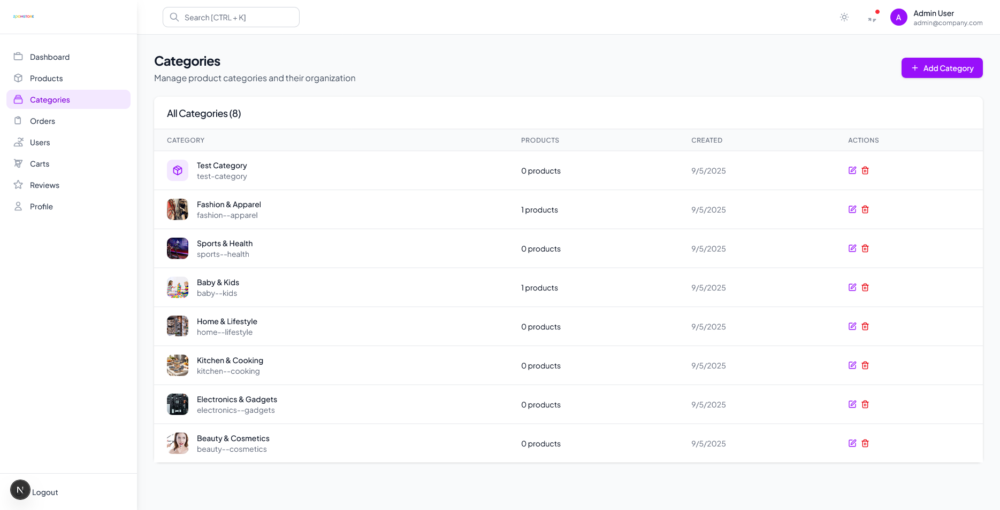

# **ZoomStore** - An Assignment from ZoomIt for Front-End/MERN Intern

_Assalamualaikum, dear reviewers, this is a task for the role of Front-End/MERN Developer Intern at ZoomIt. I just created a name for this assignment based on the company name, calling it ZoomStore. As per the requirements, I have built it using Next.js 15, React, JavaScript, Node.js, and Express.js with modern web technologies. Additionally, I have added some extra features for better performance and user experience, such as Global State Management, Real-time Cart Updates, Image Optimization with Cloudinary, Payment Checkout with stripe and comprehensive Admin Panel, which are explained in detail below._ (video coming soon)

[](https://youtu.be/your-video-id)

_Click the image to watch the video_

---

## 📑 **Table of Contents**

1. [🎥 Overview](#-overview)
2. [🚀 How to Run Locally](#-how-to-run-locally)
3. [✨ Core Features](#-core-features)
4. [👤 User Features](#-user-features)
   - [🏠 Home Page](#-home-page)
   - [🛍️ Products Page](#-products-page)
   - [📱 Product Details](#-product-details)
   - [🛒 Shopping Cart](#-shopping-cart)
   - [💳 Checkout Process](#-checkout-process)
   - [👤 User Profile](#-user-profile)
   - [🔐 Authentication](#-authentication)
5. [👨‍💼 Admin Features](#-admin-features)
   - [📊 Admin Dashboard](#-admin-dashboard)
   - [📦 Product Management](#-product-management)
   - [👥 User Management](#-user-management)
   - [🛒 Cart Management](#-cart-management)
   - [📋 Order Management](#-order-management)
   - [⭐ Review Management](#-review-management)
   - [📂 Category Management](#-category-management)
6. [🔧 Technology Stack](#-technology-stack)
7. [📁 Project Structure](#-project-structure)

---

## 🎥 **Overview**

In this video, you can quickly and more clearly understand what I have done and how I have done it.

[](https://youtu.be/your-video-id)

_Click the image to watch the video_

ZoomStore is a modern, full-featured e-commerce platform built with the MERN stack (MongoDB, Express.js, React, Node.js) using Next.js 15, featuring a responsive design, real-time cart management, and comprehensive admin panel. The application provides a seamless shopping experience for users while offering powerful management tools for administrators.

**MERN Stack Implementation:**

- **MongoDB**: Database for storing products, users, orders, and cart data
- **Express.js**: Backend API server for handling requests and business logic
- **React**: Frontend framework with Next.js 15 for building user interfaces
- **Node.js**: JavaScript runtime environment for the backend server

The application demonstrates proficiency in full-stack development with modern web technologies and best practices.

---

## 🚀 **How to Run Locally**

### **Prerequisites**

- Node.js (v18 or higher)
- npm or yarn
- MongoDB database
- Cloudinary account (for image storage)

### **Quick Setup**

1. **Clone the Repository**

```bash
   git clone https://github.com/dev-mdsohagmiya/zoomit-zoomstore.git
   cd zoomit-zoomstore
```

2. **Install Dependencies**

```bash
npm install
```

3. **Environment Variables**

   Create a `.env.local` file in the root directory:

   ```env
   NEXT_PUBLIC_API_URL=http://localhost:8000/api/v1
   NEXTAUTH_SECRET=your_nextauth_secret
   NEXTAUTH_URL=http://localhost:3000
   ```

4. **Start Development Server**

```bash
npm run dev
```

5. **Open Browser**
   - Navigate to `http://localhost:3000`
   - Start exploring the platform!

---

## ✨ **Core Features**

### **🛍️ E-commerce Functionality**

- ✅ **Product Catalog**: Browse and search products with advanced filtering
- ✅ **Shopping Cart**: Add, remove, and manage cart items with real-time updates
- ✅ **Checkout Process**: Secure payment processing with Stripe integration and order management
- ✅ **Payment Integration**: Stripe payment gateway for secure card and cash payments
- ✅ **User Authentication**: Login, register, and profile management
- ✅ **Responsive Design**: Mobile-first design that works on all devices

### **👨‍💼 Admin Management**

- ✅ **Dashboard**: Comprehensive analytics and overview
- ✅ **Product Management**: Create, update, and manage products
- ✅ **User Management**: Manage users and admin roles
- ✅ **Order Management**: Process and track orders
- ✅ **Category Management**: Organize products by categories

### **🔧 Technical Features**

- ✅ **Global State Management**: Real-time cart state synchronization
- ✅ **Server Actions**: Next.js 15 server actions for API calls
- ✅ **Stripe Payment Integration**: Secure payment processing with Stripe gateway
- ✅ **Image Optimization**: Cloudinary integration for image storage
- ✅ **Error Handling**: Comprehensive error handling and loading states
- ✅ **Performance Optimization**: Optimized for production with build optimization

---

## 👤 **User Features**

### **🏠 Home Page**

The home page provides an overview of the store with featured products and categories.



**Features:**

- Hero section with featured product showcase
- Categories grid with beautiful images
- Featured products section
- Responsive design for all devices

### **🛍️ Products Page**

Browse and search through the complete product catalog with advanced filtering options.



**Features:**

- Product grid with pagination
- Advanced search and filtering
- Category-based filtering
- Price range filtering
- Sort by price, rating, and date
- Mobile-responsive design

### **📱 Product Details**

Detailed product view with image gallery, specifications, and purchase options.


**Features:**

- High-quality image gallery with zoom
- Product specifications and descriptions
- Size and color selection
- Add to cart functionality
- Related products section
- Sticky image section for better UX

### **🛒 Shopping Cart**

Manage your cart items with real-time updates and easy modification.

**Features:**

- Real-time cart updates
- Quantity adjustment
- Item removal
- Price calculation
- Mobile-optimized cart modal

### **💳 Checkout Process**

Secure and streamlined checkout process with Stripe payment integration and multiple payment options.



**Features:**

- Single-page checkout with Stripe integration
- Multiple payment methods (Cash/Card)
- Stripe payment gateway for secure card processing
- Real-time payment validation
- Address management
- Order summary with price breakdown
- Secure payment processing with Stripe
- Payment intent creation and confirmation

### **👤 User Profile**

Manage your account information and view order history.



**Features:**

- Profile information management
- Order history
- Address management
- Account settings

### **🔐 Authentication**

Secure authentication system with role-based access control.




**Features:**

- User registration and login
- Password reset functionality
- Role-based access control
- Protected routes
- Auto-redirect for logged-in users

---

## 👨‍💼 **Admin Features**

### **📊 Admin Dashboard**

Comprehensive dashboard with analytics and quick access to all admin functions.


**Features:**

- Overview statistics
- Quick action buttons
- Recent activity
- Performance metrics

### **📦 Product Management**

Complete product management system with CRUD operations.



**Features:**

- Create, read, update, delete products
- Image upload with Cloudinary
- Category assignment
- Stock management
- Bulk operations

### **👥 User Management**

Manage users and admin roles with comprehensive user administration.



**Features:**

- User listing with pagination
- Role management (User, Admin, SuperAdmin)
- User creation and editing
- Search and filtering
- Bulk operations

### **🛒 Cart Management**

Monitor and manage user carts across the platform.



**Features:**

- View all user carts
- Individual cart details
- Cart item management
- User cart analytics

### **📋 Order Management**

Process and track orders with comprehensive order management.

**Features:**

- Order listing and filtering
- Order status management
- Payment tracking
- Order details view
- Export functionality

### **⭐ Review Management**

Moderate and manage product reviews and ratings.

**Features:**

- Review listing
- Review moderation
- Rating management
- User feedback analysis

### **📂 Category Management**

Organize products with comprehensive category management.



**Features:**

- Category CRUD operations
- Category hierarchy
- Product assignment
- Category analytics

---

## 🔧 **Technology Stack**

### **MERN Stack Implementation**

- **MongoDB**: NoSQL database for storing products, users, orders, and cart data
- **Express.js**: Backend API server with RESTful endpoints and middleware
- **React**: Frontend framework with Next.js 15 for building user interfaces
- **Node.js**: JavaScript runtime environment for the backend server

### **Frontend Technologies**

- **Next.js 15**: React framework with App Router and Server Actions
- **React 18**: Modern React with hooks, context, and state management
- **Tailwind CSS**: Utility-first CSS framework for responsive design
- **Radix UI**: Accessible component library for better UX
- **Lucide React**: Beautiful icon library for consistent design

### **Backend & Services**

- **Express.js API**: RESTful API endpoints for all operations
- **MongoDB**: Database with Mongoose ODM for data modeling
- **Stripe**: Payment gateway for secure card and cash payments
- **Cloudinary**: Image storage and optimization service
- **JWT Authentication**: Secure token-based authentication
- **Multer**: File upload middleware for image handling

### **Development Tools**

- **ESLint**: Code quality and consistency
- **Prettier**: Code formatting
- **Git**: Version control
- **npm**: Package management

---

## 📁 **Project Structure**

```
zoomit-zoomstore/
├── app/                    # Next.js App Router
│   ├── admin/             # Admin panel pages
│   │   ├── dashboard/     # Admin dashboard
│   │   ├── products/      # Product management
│   │   ├── users/         # User management
│   │   ├── orders/        # Order management
│   │   ├── reviews/       # Review management
│   │   ├── categories/    # Category management
│   │   └── carts/         # Cart management
│   ├── products/          # Product pages
│   │   └── [id]/         # Product details
│   ├── checkout/          # Checkout process
│   ├── login/            # Authentication pages
│   ├── register/
│   └── profile/          # User profile
├── components/            # React components
│   ├── admin/            # Admin-specific components
│   ├── auth/             # Authentication components
│   ├── home/             # Home page components
│   ├── providers/        # Context providers
│   └── ui/               # Reusable UI components
├── lib/                  # Utility libraries
│   ├── hooks/           # Custom React hooks
│   ├── validations/     # Form validation schemas
│   └── utils.ts         # Utility functions
├── public/              # Static assets
│   ├── docs/           # Documentation images
│   └── logo.png        # Application logo
├── middleware.js        # Next.js middleware
└── README.md           # This file
```

---

## 🚀 **Getting Started**

1. **Clone the repository**
2. **Install dependencies**: `npm install`
3. **Set up environment variables**
4. **Start development server**: `npm run dev`
5. **Open browser**: Navigate to `http://localhost:3000`

---

## 📝 **Admin Pages Status**

- ✅ **Dashboard**: Complete with analytics and overview
- ✅ **Products**: Full CRUD operations with image upload
- ✅ **Users**: User management with role-based access
- ✅ **Categories**: Category management system
- ✅ **Carts**: Cart monitoring and management
- 🚧 **Orders**: Coming soon
- 🚧 **Reviews**: Coming soon

---

**ZoomStore** - Your modern e-commerce solution built with Next.js 15 and cutting-edge web technologies! 🚀✨

---

_Built with ❤️ using Next.js 15, React, and modern web technologies_
